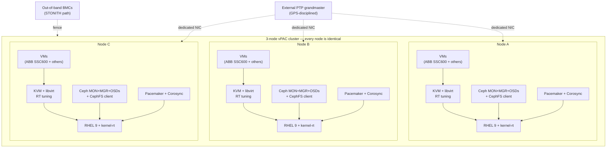
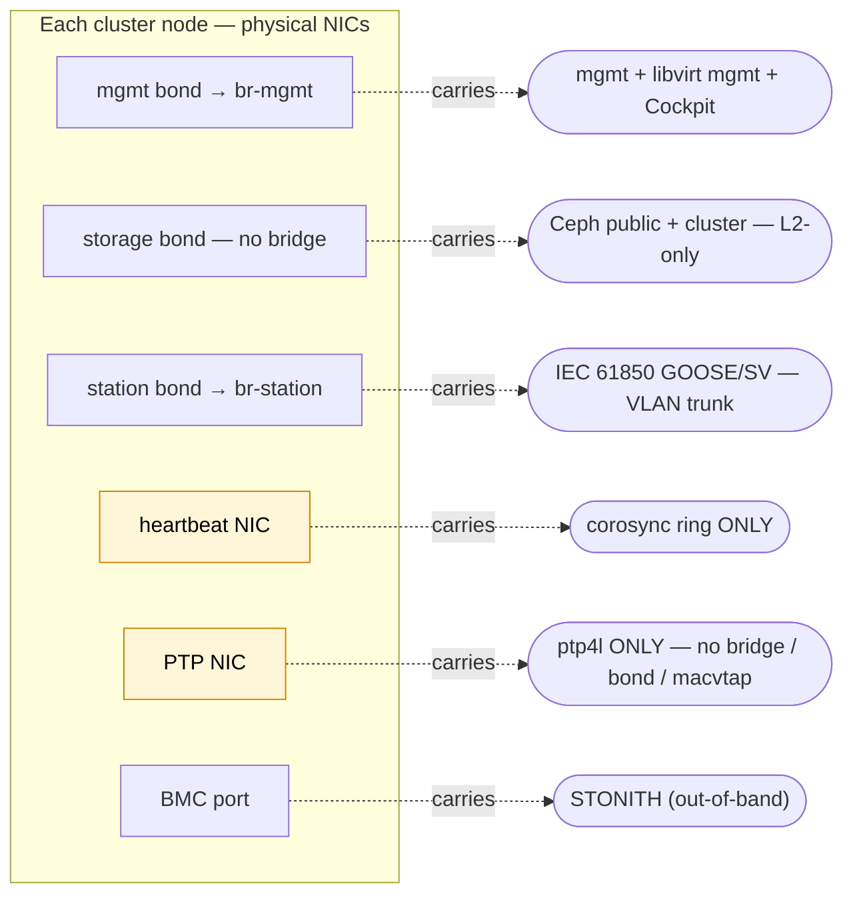
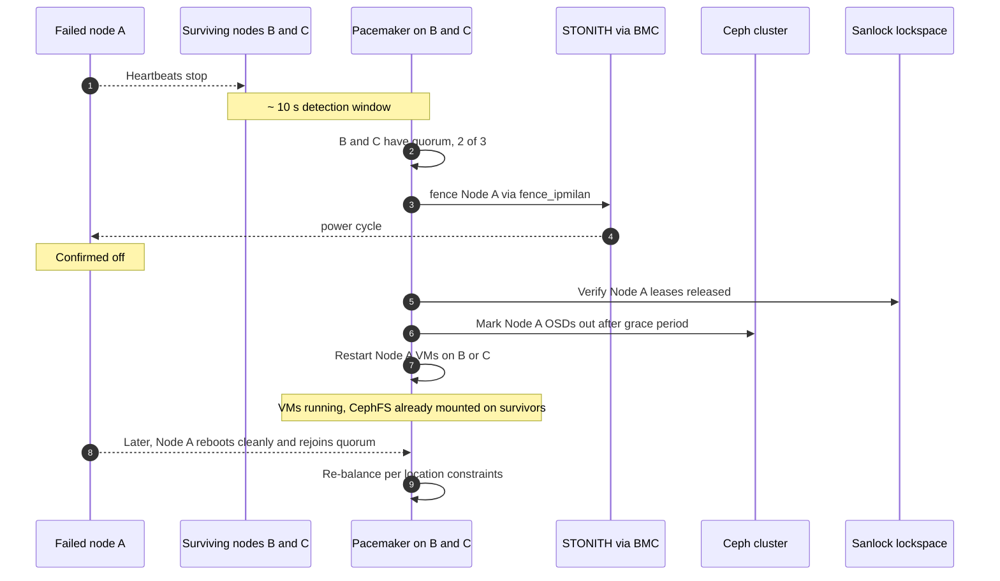

# Virtual Protection Architecture Cluster — Red Hat Pattern

A repeatable architectural pattern for deploying multi-vendor utility protection and automation workloads on a single Red Hat platform. This pattern follows the [vPAC Alliance's](https://vpacalliance.com/) software-defined architecture for substation protection, automation, and control; this document defines a specific Red Hat-based implementation of that vision. The deployment automation that puts it on hardware lives at [`github.com/RedHatEdge/ansible-vpac`](https://github.com/RedHatEdge/ansible-vpac).

---

## About the vPAC Alliance

The [**vPAC Alliance**](https://vpacalliance.com/) is an industry consortium working to define open, interoperable, and secure software-defined platforms for power-system substations — replacing traditional single-purpose protection-relay panel hardware with virtualized, vendor-neutral hosting that lets utilities adopt new protection and control software without ripping and replacing chassis.

The alliance describes its mission as:

> *"Driving standards-based, open, interoperable, and secure software-defined architecture to host protection, automation, and control solutions for power system substations."*

The alliance promotes virtualized hosting of vendor protection and automation software as the foundation for adaptive grid control — particularly important as utility grids absorb increasing renewable energy, distributed generation, and bidirectional flows.

This blueprint is a Red Hat-aligned implementation of that vision. It uses commercially-supported open-source components — Red Hat Enterprise Linux, Red Hat Ceph Storage, the RHEL HA add-on (Pacemaker + Corosync), KVM/libvirt, and Linux PTP — to realize the alliance's software-defined / open / interoperable principles in a deployable form. Other vendors and partners may produce different implementations of the same vision; the alliance's value is the shared architectural language across them, so utilities can reason about substation virtualization as a category instead of as a per-vendor proprietary system.

---

## The pattern in one paragraph

A Virtual Protection Architecture Cluster (vPAC) is three identical Red Hat Enterprise Linux servers behaving as one platform. The cluster hosts protection and automation software — IEC 61850 relays, RTAC/RTU/VPR applications, HMI workstations — as virtual machines, with deterministic real-time performance, shared storage so any VM runs on any node, sub-microsecond PTP time synchronization, and automatic failover when a node is lost.

The pattern delivers:

- Multi-vendor relay hosting on a single hardware footprint
- Sub-microsecond PTP time sync for IEC 61850 GOOSE / Sampled Values
- Real-time tail latency under 120 µs on every cluster node
- 3× replicated shared storage (Red Hat Ceph Storage)
- Automatic failover via Pacemaker with STONITH fencing
- Belt-and-suspenders against split-brain via sanlock leases on the shared storage

## Reference design

The pattern is defined by a small number of deliberate constraints, not by a specific bill of materials. Any deployment that meets them implements the pattern.

- **3 identical x86_64 servers from a single vendor** — Dell PowerEdge XR series, Advantech edge platforms, Supermicro / Crystal substation chassis, or any other Red Hat-certified server. Identical hardware is a deliberate constraint: it lets any VM run on any node after a failure without per-host quirks, and lets the deployment automation treat the three as fungible peers. Mixing chassis is supported but not recommended for a first deployment.
- **5 logical networks** with mandatory separation for two of them (PTP and cluster heartbeat). See *Architecture → Network separation* below.
- **Software stack:** RHEL 9.7+, Red Hat Ceph Storage 7, Pacemaker + Corosync (RHEL HA add-on), libvirt/KVM, PTP via `timemaster` + `ptp4l`, RT-tuned chrony for relay VMs.
- **Workloads:** any combination of vendor protection VMs and station automation applications. The proven reference workload is the **ABB SSC600** protection and control VM — Red Hat's partnership with ABB is the validated end-to-end play for this pattern, with documented vendor guidance for CPU pinning, real-time priority, hugepages, and chrony tuning. Other vendor VMs (e.g. SEL, Hitachi RTAC, GE Multilin), RTAC/VPR/PMU applications, and Windows engineering workstations with PCI NIC passthrough for traffic capture run on the same platform alongside SSC600.

## Architecture

A vPAC cluster is three RHEL 9 servers behaving as one platform: any of the three can host any virtual machine, shared storage means VM disks are reachable from every node, and a quorum protocol decides who gets to run what after a failure. The diagram below shows what's running on each node and how the layers stack.

Every node runs the identical software stack: same RHEL 9 + kernel-rt, same RT-tuned KVM/libvirt, same Ceph daemons (MON+MGR+OSDs and a CephFS client), same Pacemaker + Corosync membership, dedicated PTP NIC synchronized to the same external grandmaster. Workload placement across the three nodes is decided by Pacemaker location constraints from inventory, NOT by per-node capability differences — any VM can run on any node, and after a failure Pacemaker is free to place a VM on whichever survivor satisfies its constraints. Identical hardware + identical software is what makes this property hold.

### Network separation

The five logical networks below MUST land on separate NICs (or at least separate VLANs) for the combinations marked "dedicated". The most common production deployment failures trace back to collapsing these onto fewer physical paths.

- **Heartbeat must be dedicated** because corosync packet loss is interpreted as node failure. Bridge churn from VM lifecycle events on a shared `br-mgmt` will cause periodic STP reconvergence, drop heartbeats, and split the cluster — the most expensive failure mode in any HA system.
- **PTP must be dedicated** because PTP event messages travel as ordinary Ethernet frames; if the same NIC is bridged into a VM, the kernel's bridge handling can deliver PTP frames to the guest instead of to the host's `ptp4l`. The result is the host clock drifts free, relay VMs miss timing windows, and `SYNCHRONIZATION_FAULT` events fire continuously.
- The other three networks (mgmt, storage, station) tolerate VLAN sharing with their respective workloads, but the architecture is cleanest when each is its own bond.

### Components and why

| Component | Why |
|---|---|
| RHEL 9 | 10-year lifecycle, real-time extensions, commercial support, relay-vendor certified |
| KVM + libvirt | Open, no vendor lock-in, line-rate paravirtualized NICs, fine-grained CPU pinning |
| Ceph + CephFS | Shared VM storage so any VM runs on any node after a failure; 3× replication; no proprietary SAN |
| Pacemaker + Corosync | Automatic VM failover; proven in utility and telecom HA deployments |
| STONITH (IPMI fencing) | Prevents split-brain: the #1 failure mode in HA clusters |
| PTP (IEEE 1588) | Sub-µs time sync; required for IEC 61850 SV and GOOSE determinism |
| tuned / isolcpus / hugepages | Deterministic VM latency; well under relay timing budgets |

## Real-time guarantees

The architecture commits every cluster node to a deterministic-latency posture so any protection VM can run anywhere:

- Per-VM CPU pinning with isolated cores (kernel scheduler avoids them)
- 1 GiB hugepages backing relay VM memory
- Memory ballooning disabled, memory locked
- FIFO scheduling priority per VM (configurable per vendor's requirements)
- RT chrony tuning on every cluster node (`lock_all`, elevated `sched_priority`)
- Tail latency target under 120 µs on every cluster node

## Behavior on failure

What the cluster does autonomously when a node is lost:

Two architectural invariants are worth calling out:

- **STONITH completes before VMs restart elsewhere.** Otherwise a hung node could come back to life with the same VM also running on a survivor — silent disk corruption.
- **Sanlock-on-RBD is the second line of defense.** If Pacemaker AND fencing both fail simultaneously (a two-failure scenario), the sanlock lease on the shared lockspace prevents two qemu instances from opening the same VM disk.

## Design rationale

Why each architectural choice was made over its plausible alternatives:

| Choice | Why this rather than alternatives |
|---|---|
| **Three nodes, not two** | Quorum requires majority. Two-node clusters need an external quorum device (qdevice) which adds a single point of failure. Three nodes give majority quorum natively. |
| **CephFS for VM disks (not NFS)** | NFS requires a dedicated NFS server (single point of failure) or pNFS (operationally complex). CephFS is the storage cluster — same daemons, no extra layer to manage. |
| **RBD for the sanlock lockspace** | Sanlock needs a small shared block device with deterministic access semantics. CephFS doesn't expose block; RBD does. The lockspace image is small and rarely touched. |
| **Pacemaker `VirtualDomain` (OpenShift Virt)** | A 3-node substation cluster doesn't need a multi-tenant scheduler. Pacemaker's `VirtualDomain` is the simplest tool that solves the failover problem, with a 20-year operational track record in utility / telco. |
| **`fence_ipmilan` (not `fence_scsi`, `fence_sbd`)** | IPMI is universal on enterprise BMCs and provides hard power off — the only fencing mechanism that survives a kernel hang. SCSI fencing requires shared SCSI; SBD requires a watchdog timeout that's longer than RT scheduling latency. |
| **`timemaster` (not pure `ptp4l` + `chronyd`)** | Two daemons fighting for the system clock is a documented operational hazard. `timemaster` is a single supervisor that arbitrates correctly. |
| **Power Profile P2P, L2 transport** | IEEE C37.238 is the substation profile — peer-to-peer with transparent clocks in the network. Most utility networks are built this way. |
| **`virt-sanlock` SELinux boolean ON** | Defense in depth. Even if Pacemaker AND fencing both fail simultaneously, sanlock's lockspace lease prevents simultaneous VM start on two nodes against the same disk. |

---

_How to deploy, operate, and validate a cluster that implements this pattern: [`github.com/RedHatEdge/ansible-vpac`](https://github.com/RedHatEdge/ansible-vpac)._
