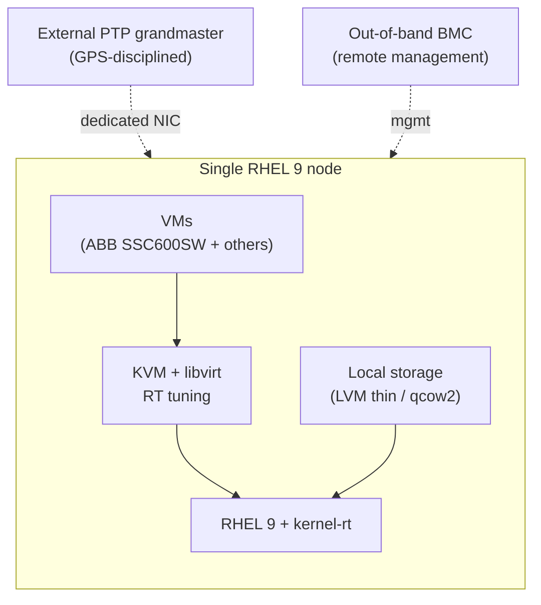
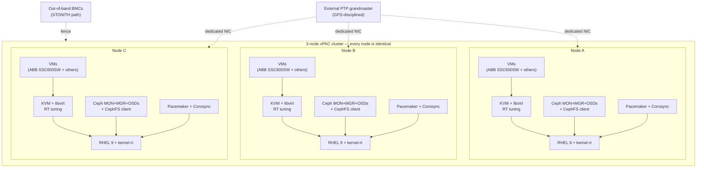
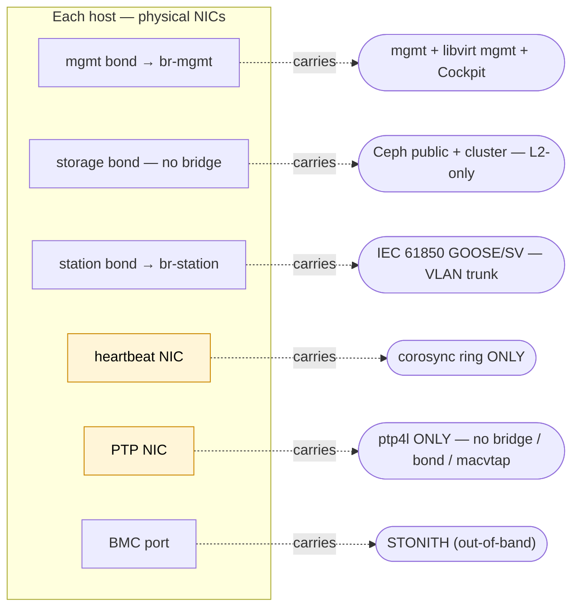
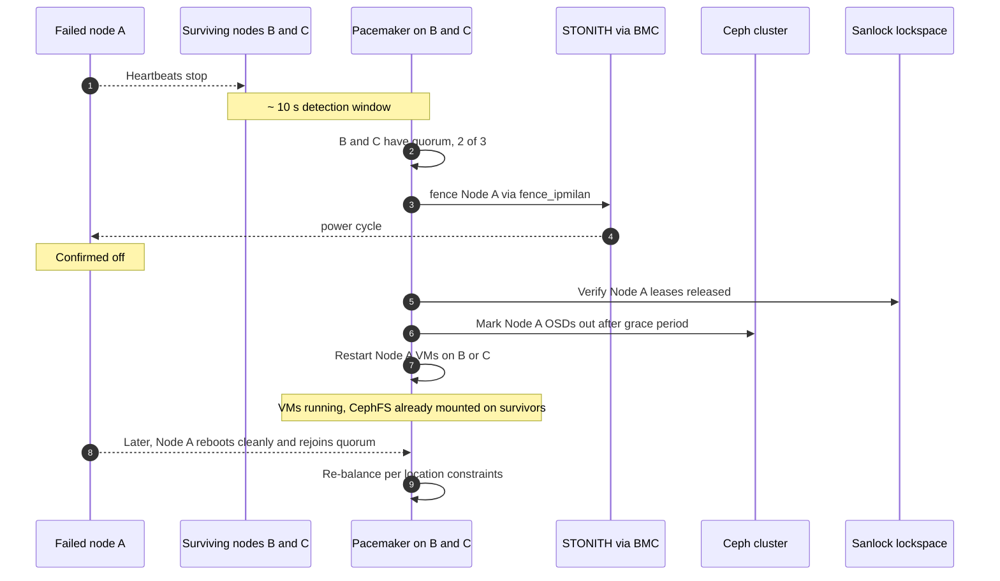

# Virtual Protection Architecture — Red Hat Pattern

A repeatable architectural pattern for deploying multi-vendor utility protection and automation workloads on a Red Hat platform. This pattern follows the [vPAC Alliance's](https://vpacalliance.com/) software-defined architecture for substation protection, automation, and control; this document defines a specific Red Hat-based implementation of that vision. The deployment automation that puts it on hardware lives at [`github.com/RedHatEdge/ansible-vpac`](https://github.com/RedHatEdge/ansible-vpac).

The pattern scales from a **single node** (small / secondary substations, retrofits, dev/lab) to a **3-node cluster** (production HA target). Both topologies share the same hypervisor, real-time tuning, time-sync, IEC 61850 plumbing, and vendor VMs — what changes between them is the cluster substrate.

> **Status:** Under active development. The architectural pattern is stable; specific commitments, tables, and wording may evolve as the Red Hat platform implementation matures. Treat numeric commitments and component lists as directional until the document drops the in-development banner.

---

## Who this is for

This blueprint is written for three audiences:

- **Utility solution architects and engineers** evaluating Red Hat as the substation platform for IEC 61850 / protection workloads.
- **System integrators** delivering vPAC deployments on Red Hat-certified hardware.
- **Red Hat partners and SAs** mapping the Red Hat ecosystem onto a customer's vPAC architecture decision.

The document defines the *what* and *why* of the architectural pattern. The *how* — Ansible roles, inventory contract, day-2 operations — lives at [`github.com/RedHatEdge/ansible-vpac`](https://github.com/RedHatEdge/ansible-vpac).

---

## About the vPAC Alliance

The [**vPAC Alliance**](https://vpacalliance.com/) is an industry consortium working to define open, interoperable, and secure software-defined platforms for power-system substations — replacing traditional single-purpose protection-relay panel hardware with virtualized, vendor-neutral hosting that lets utilities adopt new protection and control software without ripping and replacing chassis.

The alliance describes its mission as:

> *"Driving standards-based, open, interoperable, and secure software-defined architecture to host protection, automation, and control solutions for power system substations."*

The alliance promotes virtualized hosting of vendor protection and automation software as the foundation for adaptive grid control — particularly important as utility grids absorb increasing renewable energy, distributed generation, and bidirectional flows.

This blueprint is a Red Hat-aligned implementation of that vision. It uses commercially-supported open-source components — Red Hat Enterprise Linux, Red Hat Ceph Storage, the RHEL HA add-on (Pacemaker + Corosync), KVM/libvirt, and Linux PTP — to realize the alliance's software-defined / open / interoperable principles in a deployable form. Other vendors and partners may produce different implementations of the same vision; the alliance's value is the shared architectural language across them, so utilities can reason about substation virtualization as a category instead of as a per-vendor proprietary system.

For a layered, diagram-driven view that maps the industry VPR reference model onto each Red Hat component — substation context, end-to-end signal path, the real-time platform stack, and the HA topology — see **[REFERENCE-ARCHITECTURE.md](REFERENCE-ARCHITECTURE.md)**.

---

## The pattern

A Virtual Protection Architecture deployment is one or more identical Red Hat Enterprise Linux servers hosting utility protection and automation workloads as virtual machines. Every deployment shares the same Red Hat platform commitments:

- **RHEL 9 + kernel-rt** on every host — 10-year lifecycle, FIPS-mode cryptography available on demand, commercial support, relay-vendor-certified
- **KVM + libvirt** as the hypervisor — open, no vendor lock-in, line-rate paravirtualized NICs, fine-grained CPU pinning, per-VM RT-XML invariants
- **Real-time tuning** on the host so VMs achieve deterministic latency — isolated CPU pool, 1 GiB hugepages, locked memory, FIFO scheduling, ballooning disabled, watchdog neutered
- **IEC 61850 station and process bus** preserved end to end through libvirt — multicast pass-through, dedicated VLANs, no software re-timestamping
- **Dedicated PTP NIC** synchronized to a Power Profile grandmaster via `linuxptp` + `timemaster`
- **Defence-in-depth security** built into the platform — SELinux enforcing, FIPS-mode crypto on demand, signed RPMs and container images, SPDX SBOM, audit forwarding, vTPM 2.0 on KVM
- **Multi-vendor relay hosting** — the **ABB SSC600SW** protection and control VM is the validated Red Hat × ABB reference workload; other vendor VMs (e.g. Schneider Electric, Siemens, Siemens Energy, GE Vernova, Hitachi RTAC, Kalkitech) can run on the same platform alongside RTAC / VPR / PMU applications and Windows engineering workstations with PCI NIC passthrough

The pattern's value at any scale: a single Red Hat-supported platform that hosts the substation's protection and automation software, decoupling the hardware refresh from the software refresh and letting the operator adopt new vendor VMs without changing the underlying stack.

---

## Topologies

The architecture above manifests in two reference topologies. Pick the one that matches site criticality and footprint constraints.

### Single-node

One RHEL 9 server hosting protection and automation VMs locally. Used at distribution-level and secondary substations, retrofit sites where a 3-node footprint won't fit, dev/lab environments, and any site where the resiliency profile is satisfied by **box-level redundancy at the grid level** (two independent single-node platforms per substation, or accepted risk for non-critical sites) rather than by clustering inside one box.

What it has (every Red Hat platform commitment from *The pattern* above), plus:
- **Local storage** for VM disks — LVM thin pool, or local qcow2 on a fast NVMe pair
- **Single libvirt host** managing VMs directly via `virsh` and standard libvirt tooling

What it does NOT have (and does not need at N=1):
- No Pacemaker / Corosync — no in-box failover
- No Ceph — local storage only
- No sanlock leases — no shared storage means no split-brain to defend against
- No STONITH fencing — nothing to fence against
- No quorum protocol

**On hardware failure** at single-node, the box is down until repaired or replaced; VMs come back via the same deployment automation once the hardware is up, or are migrated to a hot spare provisioned identically. Resilience at this topology is the operator's grid-level redundancy program, not an in-box mechanism. The platform's commitment is deterministic real-time hosting, not high availability.

### Three-node clustered

Three identical RHEL 9 servers behaving as one platform. The cluster runs protection VMs continuously across the failure of any single node, with no operator intervention.

What it adds beyond single-node:
- **Red Hat Ceph Storage with 3× replication** — MON+MGR+OSDs and a CephFS client on every node, RBD-backed sanlock lockspace
- **Automatic VM failover** via Pacemaker + Corosync with native majority quorum (2 of 3)
- **STONITH (IPMI fencing)** via `fence_ipmilan` to prevent split-brain after a node hang
- **Sanlock leases on the RBD lockspace** as belt-and-suspenders against simultaneous Pacemaker + STONITH failure
- **Any-VM-anywhere** — workload placement is decided by Pacemaker location constraints from inventory, not by per-node capability; identical hardware + identical software is what makes this property hold

**On node failure** at three-node, the cluster fences the failed node, restarts its VMs on a survivor with CephFS already mounted, and re-balances per location constraints when the node rejoins. No operator action required.

### Side-by-side

| Dimension | Single-node | Three-node clustered |
|---|---|---|
| Hardware | 1 RHEL 9 server | 3 identical RHEL 9 servers (single vendor / SKU) |
| Hypervisor | KVM + libvirt | KVM + libvirt — every node |
| Real-time tuning | Per-VM pinning, hugepages, FIFO scheduling | Same — every node |
| PTP | Dedicated NIC, Power Profile grandmaster | Same — every node |
| IEC 61850 station + process bus | Preserved end to end | Same |
| Storage | Local (LVM thin / qcow2) | Red Hat Ceph Storage, 3× replicated, CephFS + RBD |
| HA / failover | None — operator intervention | Automatic via Pacemaker + Corosync |
| Fencing | N/A | STONITH via `fence_ipmilan` |
| Split-brain protection | N/A (no shared state) | Sanlock-on-RBD + STONITH |
| Quorum | N/A | Native majority (2 of 3) |
| On node failure | Box down until repaired | Automatic failover; VMs running on survivors |
| Typical site | Distribution / secondary substation, retrofit, dev/lab | Primary substation, transmission-level, critical infrastructure |
| Minimum NICs per host | 4 (mgmt, station, PTP, BMC) | 6 (mgmt, storage, station, heartbeat, PTP, BMC) |

The same RHEL build, RT tuning, KVM configuration, PTP setup, IEC 61850 plumbing, and vendor VMs work in both topologies. What differs is the cluster substrate.

---

## Reference design constraints

The pattern is defined by a small number of deliberate constraints, not by a specific bill of materials. Any deployment that meets them implements the pattern.

- **Red Hat-certified x86_64 servers**, ranging from fanless brick form factors for small substations to fan-cooled rack-mount servers for larger sites. See *Hardware footprint* below. Reference families include Dell PowerEdge XR, Advantech ECU platforms, Moxa DA series, Welotec RSAPC Mk2, Lanner ICS, Supermicro / Crystal substation chassis. At three-node the three nodes are **identical hardware from a single vendor and SKU** — this lets any VM run on any node after a failure without per-host quirks, and lets deployment automation treat the three as fungible peers.
- **Logical networks with mandatory separation:** *PTP* on its own NIC (all topologies); *cluster heartbeat* on its own NIC (three-node only). See *Network separation* below.
- **Software stack:** RHEL 9.7+, libvirt/KVM, PTP via `timemaster` + `ptp4l`, RT-tuned chrony. Add Red Hat Ceph Storage 7 + RHEL HA add-on (Pacemaker + Corosync) at three-node.
- **Workloads:** any combination of vendor protection VMs and station automation applications. The proven reference workload is the **ABB SSC600SW** protection and control VM — Red Hat's partnership with ABB is the validated end-to-end play for this pattern, with documented vendor guidance for CPU pinning, real-time priority, hugepages, and chrony tuning.

---

## Architecture

### Single-node

A single host with the full real-time / PTP / IEC 61850 stack, but no cluster substrate. The BMC remains an out-of-band management path even though it has no fencing role at N=1.

### Three-node clustered

Every node runs the identical software stack: same RHEL 9 + kernel-rt, same RT-tuned KVM/libvirt, same Ceph daemons, same Pacemaker + Corosync membership, dedicated PTP NIC synchronized to the same external grandmaster. Workload placement is decided by Pacemaker location constraints, NOT by per-node capability differences — any VM can run on any node, and after a failure Pacemaker is free to place a VM on whichever survivor satisfies its constraints. Identical hardware + identical software is what makes this property hold.

### Network separation

The logical networks below MUST land on separate NICs (or at least separate VLANs) for the combinations marked "dedicated". The most common production deployment failures trace back to collapsing these onto fewer physical paths.

- **PTP must be dedicated** (all topologies) because PTP event messages travel as ordinary Ethernet frames; if the same NIC is bridged into a VM, the kernel's bridge handling can deliver PTP frames to the guest instead of to the host's `ptp4l`. The result is the host clock drifts free, relay VMs miss timing windows, and `SYNCHRONIZATION_FAULT` events fire continuously.
- **Heartbeat must be dedicated** (three-node only) because corosync packet loss is interpreted as node failure. Bridge churn from VM lifecycle events on a shared `br-mgmt` will cause periodic STP reconvergence, drop heartbeats, and split the cluster — the most expensive failure mode in any HA system.
- The other networks (mgmt, station, plus storage at three-node) tolerate VLAN sharing with their respective workloads, but the architecture is cleanest when each is its own bond. At single-node, the dedicated storage network collapses to local-disk paths and is not required as a separate fabric.
- Additional NICs can be required depending on the workload (e.g. dedicated Process Bus connections; virtualized or directly passed through to vPAC VMs)

### Components and why

| Component | Topologies | Why |
|---|---|---|
| RHEL 9 + kernel-rt | All | 10-year lifecycle, real-time extensions, commercial support, relay-vendor certified |
| KVM + libvirt | All | Open, no vendor lock-in, line-rate paravirtualized NICs, fine-grained CPU pinning |
| `tuned` / isolcpus / hugepages | All | Deterministic VM latency well under relay timing budgets |
| PTP (`linuxptp` + `timemaster`) | All | Sub-µs time sync; required for IEC 61850 SV and GOOSE determinism |
| Local storage (LVM thin / qcow2) | Single-node | Simplest viable VM disk path at N=1; no shared-storage operational surface |
| Red Hat Ceph Storage + CephFS | Three-node | Shared VM storage so any VM runs on any node after a failure; 3× replication; no proprietary SAN |
| RHEL HA add-on (Pacemaker + Corosync) | Three-node | Automatic VM failover; proven in utility and telecom HA deployments |
| STONITH (`fence_ipmilan`) | Three-node | Prevents split-brain: the #1 failure mode in HA clusters |
| Sanlock-on-RBD lockspace | Three-node | Defense in depth against simultaneous Pacemaker + STONITH failure |

---

## Real-time guarantees

The Red Hat platform commits every host to a deterministic-latency posture so any protection VM can run anywhere:

- Per-VM CPU pinning with isolated cores (kernel scheduler avoids them)
- 1 GiB hugepages backing relay VM memory
- Memory ballooning disabled, memory locked
- FIFO scheduling priority per VM (configurable per vendor's requirements)
- RT chrony tuning on every host (`lock_all`, elevated `sched_priority`)
- Watchdog disabled on the host to prevent watchdog scheduler interference

Platform performance commitments, aligned with vPAC Alliance specifications for critical applications:
- **Cyclictest**: maximum host latency under 100 µs over 7+ days of continuous testing with all CPUs stressed
- **Ping-pong** (round-trip GOOSE between two VMs across the hypervisor): maximum under 250 µs over 7+ days of continuous testing

These are platform commitments. Vendor protection-VM image performance is the vendor's responsibility above this floor.

---

## Time synchronization

PTP integration on the Red Hat host:

- **Dedicated PTP NIC** synchronized to an external Power Profile grandmaster (IEEE C37.238 / IEC 61850-9-3), typically GPS-disciplined
- **`linuxptp`** (`ptp4l`) running against the dedicated NIC's PHC for hardware time-stamping
- **`timemaster`** as the single arbitrator between PTP and the system clock — never running `ptp4l` and `chronyd` head-to-head on the system clock
- **PHC-to-system-clock discipline** via `phc2sys`; guest VMs consume time via their virtio time source or, where the relay vendor requires it, via PCI passthrough of a PTP-capable NIC

**On grandmaster failure:** with two configured grandmasters and BMCA in the time fabric, holdover lasts only until the secondary becomes BMCA-elected; the host clock stays within Power Profile bounds throughout. With a single grandmaster, the host enters holdover up to the limit of the system clock's stability, and the platform publishes time-source status to relay VMs via a shared file so vendor images can react to a degraded time source per their own protection logic. Either way, time-source degradation is operator-visible, not silent.

The PTP NIC is dedicated for the reason called out in *Network separation* — bridging a PTP NIC into a VM bridge causes the kernel's bridge logic to deliver PTP event frames to the guest rather than to the host's `ptp4l`, the most common silent failure mode in virtualized PTP.

---

## Cybersecurity and compliance

The Red Hat platform supports the security commitments customers need to meet their regulatory and standards programs. The platform provides the technical primitives; the customer operates the program.

**Alignment** (deep mappings live in implementation documentation):
- **IEC 62443** — the platform's network segmentation, signed supply chain, audit forwarding, vTPM 2.0, and SELinux baselines support customer programs targeting IEC 62443 SL-2 by default, with SL-3 attainable through TPM-rooted identity and per-VM micro-segmentation.
- **IEC 62443 zones-and-conduits model** — the architecture's network and SELinux segmentation supports a customer's zone-and-conduit deployment without re-architecting; control-by-control mapping lives in `ansible-vpac` integration documentation.
- **NERC CIP** (CIP-005, -006, -007, -009, -010, -013, -015) — the platform provides the technical primitives (separated management plane, version-controlled baseline, signed supply chain, audit forwarding, INSM hooks). The utility operates the regulatory program.
- **NIS2 (EU) and equivalent national frameworks** — the same platform primitives map to NIS2 obligations.
- **FIPS 140-3** — RHEL 9 FIPS-mode cryptographic API + OpenSSL + GnuTLS + NSS + OpenSSH, available via an inventory toggle.

**Platform-provided security primitives:**

| Primitive | What the platform provides |
|---|---|
| Hardware root of trust | TPM 2.0 attestation on the host; vTPM 2.0 on KVM for guest measured boot |
| Crypto stack | FIPS 140-3 mode for RHEL kernel crypto, OpenSSL, GnuTLS, NSS, OpenSSH (per inventory toggle) |
| Mandatory access control | SELinux enforcing on every host; per-VM contexts; libvirt-confined VMs |
| Signed supply chain | All RPMs signed; container images signed; Ansible content from a known source; SPDX SBOM per release |
| Identity / RBAC | X.509 PKI-driven; layered RBAC at host (sudo / IdP), cluster (Pacemaker), and VM (libvirt) |
| Audit | `auditd` + `journald` → SIEM forwarding; CIP-007-aligned event log |
| Internal network monitoring | east-west tap points + Pacemaker / Corosync telemetry + SNMPv3 — supports CIP-015 INSM requirements |
| Patching | rolling per-node updates without protection downtime; signed errata via Red Hat Satellite or local mirror |
| Air-gapped operation | local builder mirror + container registry; no outbound internet required after deployment |

Cybersecurity certification of relay VM images, NERC CIP entity registration, IEC 62443-3-2 zones-and-conduits assessment, SIEM operation, and personnel / training (CIP-004) are the customer's responsibility. The platform is engineered to make those programs straightforward to execute, not to execute them for the customer.

---

## Behavior on failure

### Single-node

If the host fails, all VMs on it stop. Recovery is:

1. The hardware fault is identified by site operators or a centralized monitoring path (BMC alerting, SNMP, IPMI).
2. The hardware is repaired or swapped to a hot spare provisioned identically.
3. VMs are brought back via the same deployment automation that originally placed them.

Resilience at this topology is the operator's grid-level redundancy program, not the platform.

### Three-node clustered

What the cluster does autonomously when a node is lost:

Two architectural invariants are worth calling out:

- **STONITH completes before VMs restart elsewhere.** Otherwise a hung node could come back to life with the same VM also running on a survivor — silent disk corruption.
- **Sanlock-on-RBD is the second line of defense.** If Pacemaker AND fencing both fail simultaneously (a two-failure scenario), the sanlock lease on the shared lockspace prevents two qemu instances from opening the same VM disk.

---

## Hardware footprint

The Red Hat platform runs across the full range of substation server form factors. Customer selection is driven by site footprint and workload weight, not by platform compatibility:

| Form factor | Cooling | Power | Best for |
|---|---|---|---|
| Brick (~4U fanless) | Passive | DC-only (24–125 V) | Smaller substations; single-node retrofit; thermal-sensitive sites |
| 2U rack-mount, fanless | Passive | DC-only (24–220 V) | Medium substations; reduced moving parts |
| 2U rack-mount, fan-cooled | Active | Universal AC + DC | Medium-to-large substations needing higher CPU / PCIe density |
| 3U rack-mount, fan-cooled | Active | Universal AC + DC | Large substations with AI/ML closed-loop or significant non-RT workload |

All form factors host the same RHEL build, same KVM hypervisor, same RT tuning, and same vendor relay VMs. Memory and storage scale per Red Hat-certified server. The 3-node clustered topology requires identical SKUs across nodes; single-node has no such constraint and is the right place to start with a mixed-vendor refresh.

---

## Where this fits in the broader ecosystem

The vPAC Alliance defines the architectural pattern; multiple implementations of that pattern exist. The two most prominent:

- **The Red Hat-aligned implementation defined in this document** — RHEL + KVM + Red Hat Ceph Storage + RHEL HA Add-on + Ansible. Commercially supported. The deployment automation lives at [`ansible-vpac`](https://github.com/RedHatEdge/ansible-vpac).
- **[LF Energy SEAPATH](https://lfenergy.org/projects/seapath/)** — an open-source reference implementation of the same architectural target, originating with French TSO RTE, built on Debian / Yocto / CentOS Stream + KVM + Pacemaker + Ceph + OVS + Ansible. Production-deployed at RTE since end-2023.

Red Hat is a member of both the vPAC Alliance and LF Energy, and contributed the CentOS Stream 9 port to SEAPATH. The architectural commitments are intentionally compatible: a utility running SEAPATH on Debian today can adopt RHEL as the commercially-supported substrate without re-architecting. The Red Hat-aligned implementation in this document is what a customer gets when they want a Red Hat-supported lifecycle — 10-year RHEL, signed errata, Insights, Satellite, Image Builder — under the same architectural pattern.

---

## Design rationale

Why each architectural choice was made over its plausible alternatives:

| Choice | Why this rather than alternatives |
|---|---|
| **Two reference topologies (1-node and 3-node), not a continuum** | The same pattern applies at both scales. N=1 serves small / distribution sites and dev/lab; N=3 is the production HA target. N=2 is not a reference topology — two-node clusters need an external quorum device (qdevice) which adds a single point of failure. N≥4 is not the documented reference; the architecture does not preclude it. |
| **Three nodes (when clustered), not two** | Quorum requires majority. Three nodes give majority quorum natively without an external arbiter. |
| **CephFS for VM disks (not NFS)** | NFS requires a dedicated NFS server (single point of failure) or pNFS (operationally complex). CephFS is the storage cluster — same daemons, no extra layer. |
| **RBD for the sanlock lockspace** | Sanlock needs a small shared block device with deterministic access semantics. CephFS doesn't expose block; RBD does. The lockspace image is small and rarely touched. |
| **Pacemaker `VirtualDomain` — NOT OpenShift Virtualization, NOT OpenStack** | A substation deployment doesn't need a multi-tenant scheduler as it is typically very bespoke and static. Pacemaker's `VirtualDomain` resource agent on libvirt/KVM is the simplest tool that solves the VM failover problem, with a 20-year operational track record in utility / telco. OpenShift Virtualization (KubeVirt) and OpenStack target multi-tenant compute — different problem, different operational and certification surface, different scale assumptions. The pattern is RHEL + KVM + Pacemaker + Ceph; it is not a containers-on-Kubernetes pattern. |
| **`fence_ipmilan` (not `fence_scsi`, `fence_sbd`)** | IPMI is universal on enterprise BMCs and provides hard power off — the only fencing mechanism that survives a kernel hang. SCSI fencing requires shared SCSI; SBD requires a watchdog timeout longer than RT scheduling latency. |
| **`timemaster` (not pure `ptp4l` + `chronyd`)** | Two daemons fighting for the system clock is a documented operational hazard. `timemaster` is a single supervisor that arbitrates correctly. |
| **Power Profile P2P, L2 transport** | IEEE C37.238 is the substation profile — peer-to-peer with transparent clocks in the network. Most utility networks are built this way. |
| **`virt-sanlock` SELinux boolean ON** | Defense in depth. Even if Pacemaker AND fencing both fail simultaneously, sanlock's lockspace lease prevents simultaneous VM start on two nodes against the same disk. |
| **Local storage at single-node, not "Ceph-of-one"** | A single-node Ceph deployment has the operational complexity of Ceph without any of its resiliency benefits. LVM thin or local qcow2 is the simpler, fully supported VM disk path at N=1. |

---

_How to deploy, operate, and validate a deployment that implements this pattern: [`github.com/RedHatEdge/ansible-vpac`](https://github.com/RedHatEdge/ansible-vpac)._
