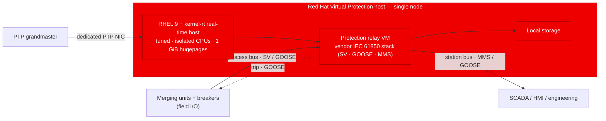
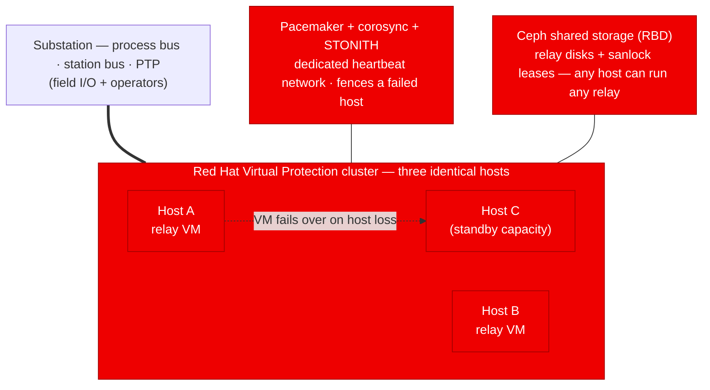
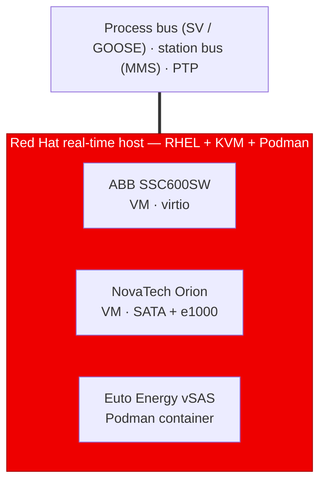

# Reference architecture

Two ways to deploy a Red Hat Virtual Protection host, from the same platform and
the same generic node image: a **single node** for non-critical or cost-sensitive
sites, and a **three-node high-availability cluster** where a relay must survive
the loss of a host. Both run the vendor's IEC 61850 protection software as a VM
on real-time-tuned RHEL.

The diagrams below render natively on GitHub. Red = the part Red Hat provides;
grey = field/operator equipment outside Red Hat's scope.

---

## Single node

The minimal deployment: one real-time RHEL host running the protection relay VM
against local storage. No clustering, no shared storage — fewer moving parts,
lower cost, and a single point of failure that is acceptable for many sites.

---

## Three-node, high availability

The same host image, deployed on three machines that form a cluster. If a host
fails, its relay VM restarts on another host automatically. This adds the three
ingredients single-node leaves out: **Pacemaker** to orchestrate failover,
**STONITH** to fence a failed host before its VM restarts elsewhere, and
**Ceph** to give every host access to the same relay disk.

---

## Relay workloads — VMs and containers

The platform hosts the vendor's IEC 61850 protection software **unmodified**. A
relay can run as a full VM or as a container, and the platform adapts to whatever
the vendor ships — paravirtualized or not, VM or container. The deployment's
Ansible variable file selects the right profile per relay, so one host can run a
virtio VM, a non-virtio VM, and a container side by side.

> Red = the Red Hat platform; the boxes inside are the vendor relay workloads it
> hosts (Red Hat provides the host, not the relay software).

| Relay | Packaging | Host adaptation | Delivery |
|---|---|---|---|
| **ABB SSC600SW** | VM (virtio) | guest has virtio → virtio disk + NICs; vCPUs pinned, `SCHED_FIFO` 50 | `.cab` → raw KVM image; licensed per-VM via ABB PCM600 after boot |
| **NovaTech Orion** | VM (non-virtio) | Photon OS guest has no virtio → **SATA disk + e1000 NIC**; `SCHED_FIFO` 40 | VMware OVA → qcow2 / raw; rendered with the `vpr` profile |
| **Euto Energy vSAS** | Podman container | no VM, no guest OS — **shares the host real-time kernel**; pinned via cgroup cpuset, managed by systemd (Quadlet) | OCI container image → `podman` |

The common thread is one Red Hat real-time host with several packaging models on
it. A VM gives stronger isolation and runs a vendor's exact appliance image
untouched; a container is lighter and shares the host kernel — pick per workload.

---

## What both share

Every deployment — one node or three — is the **same Red Hat real-time host**,
made site-specific by an Ansible variable file at deploy time. The platform
commitments are identical:

- **RHEL 9 + kernel-rt** real-time host, tuned (`realtime-virtual-host`), with
  isolated CPUs, 1 GiB hugepages, and LLC isolation for deterministic latency
- **KVM + libvirt** hosting the vendor relay VM with pinned vCPUs, locked
  hugepage memory, and the real-time XML invariants
- **linuxptp** time synchronization on a dedicated NIC
- **Separated networks** — management, station bus, process bus, and PTP kept
  apart; the cluster adds a dedicated heartbeat network

The three-node cluster simply layers **Pacemaker + corosync + STONITH** and
**Ceph** on top of that shared base. Single node is the same platform with those
high-availability layers removed.

How that host is provisioned — a conventional package-based install or an
image-mode (bootc) image — is a delivery flavor, not a change to the
architecture. Either produces the same real-time host.

---

## Choosing between them

| | Single node | Three-node cluster |
|---|---|---|
| Survives a host failure | No | Yes — relay restarts on another host |
| Storage | Local disk | Ceph (shared, replicated) |
| Failover orchestration | — | Pacemaker + corosync + STONITH |
| Hardware | One host | Three hosts + cluster networking |
| Best for | Cost-sensitive or non-critical sites, labs, evaluation | Workload that must stay available/redundant through a (planned or unplanned) host loss |
