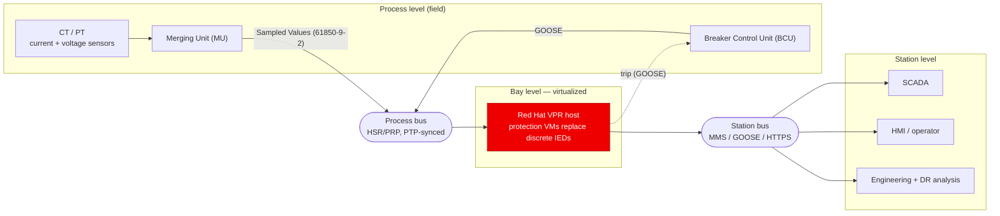
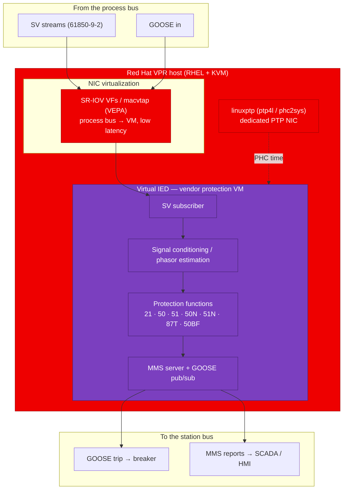
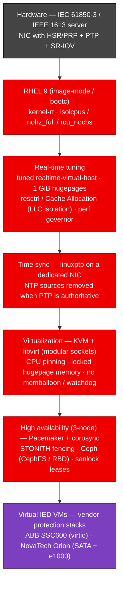
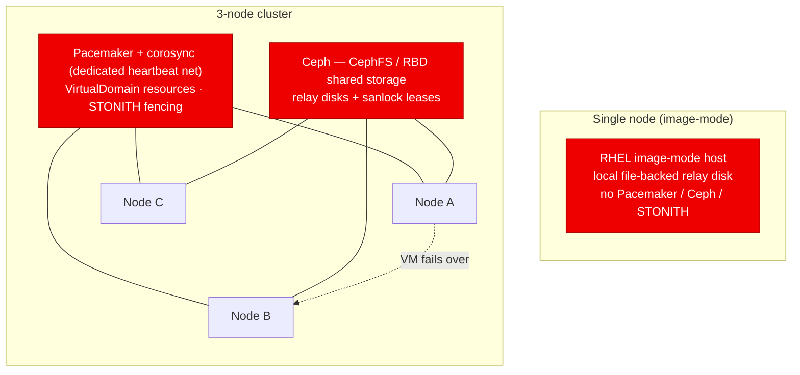

# Red Hat Virtual Protection reference architecture

The vPAC Alliance / Intel "Virtual Protection Relay" whitepaper describes the VPR
concept in **vendor-neutral** terms — an IEC 61850 digital substation whose
bay-level IEDs are collapsed into protection VMs on a real-time virtualized host.
This document keeps that reference model and plugs in the **Red Hat
implementation** for each layer: RHEL (image-mode), KVM/libvirt, the real-time
stack, Pacemaker/Ceph for high availability, and `linuxptp` for time.

Source model: *Virtual Protection Relay — A Paradigm Shift in Power System
Protection* (vPAC Alliance / Intel / Kalkitech), Figures 2–8. All diagrams below
are original Mermaid representations and render natively on GitHub.

---

## 1. Substation context (IEC 61850) — where the host sits

The reference model (whitepaper Fig 2) splits a digital substation into three
levels joined by a **process bus** (raw current/voltage as Sampled Values, plus
GOOSE) and a **station bus** (MMS/GOOSE to SCADA and operators). The Red Hat VPR
host replaces a rack of discrete bay-level IEDs with protection VMs.

> Red in every diagram = the part Red Hat provides. Field devices (MU/BCU,
> CT/PT) and the SCADA/operator front end are unchanged customer/vendor kit.

---

## 2. The Red Hat VPR host — end-to-end signal path

This is the whitepaper's master reference application (Fig 8) with the Red Hat
platform plugged in. Sampled Values arrive from the process bus, are processed by
the vendor protection stack inside a **Virtual IED** VM, and a trip is published
back as GOOSE — all on a real-time-tuned RHEL/KVM host.

---

## 3. The Red Hat platform stack (real-time enablement)

The whitepaper's real-time enablement (Fig 5, Intel TCC) and server/NIC layers
(Fig 6) map directly onto the Red Hat real-time stack. Bottom to top:

---

## 4. High availability — single node vs 3-node cluster

The whitepaper notes a VPR gains redundancy from the "host server or VM
management console" handling failover (Fig 7). Red Hat implements that with
**Pacemaker/corosync + STONITH** for orchestration and **Ceph** for the shared
disk a VM needs to restart on another node. Single-node skips all of it.

---

## 5. Reference model → Red Hat implementation

| Whitepaper concept | Fig | Red Hat implementation |
|---|---|---|
| Virtualized host / hypervisor | 3–7 | **RHEL + KVM + libvirt** (modular sockets); image-mode (bootc) for single-node |
| Software container option | 2.3 | **Podman** (per-function microservices where used) |
| Real-time board support package | 5 | **kernel-rt**, `isolcpus`/`nohz_full`/`rcu_nocbs`, 1 GiB hugepages |
| Real-time tuning / TCC tools | 5 | **tuned `realtime-virtual-host`**, performance governor |
| Cache Allocation (LLC isolation) | 2.4.1 | **resctrl** mount + CAT classes pinned to the relay's cores |
| Deterministic ~5 ms system timescale | 2.4.2 | pinned vCPUs + `SCHED_FIFO` (SSC600 prio 50, Orion 40), locked memory |
| Precision Time Protocol | 2.4.3 | **linuxptp** (`ptp4l`/`phc2sys`) on a **dedicated** NIC; NTP removed |
| Next-gen NIC (HSR/PRP, PTP, SR-IOV) | 2.4.4 / 6 | **SR-IOV VFs / macvtap (VEPA)** to the process bus; PTP-capable NIC |
| Process bus (SV + GOOSE) | 2 / 8 | dedicated **process-bus** interface, reserved, macvtap-attached |
| Station bus (MMS / GOOSE) | 2 / 8 | **station-bus** Linux bridge; mgmt bridge for the host |
| VPR redundancy / HA cluster | 7 | **Pacemaker + corosync + STONITH** on a dedicated heartbeat network |
| Shared storage for VM failover | 7 | **Ceph** (CephFS / RBD) + **sanlock** leases (3-node only) |
| Virtual IED (SV sub, conditioning, PF, MMS) | 3/4/8 | the **vendor relay VM** (ABB SSC600 / NovaTech Orion), hosted unchanged |
| Front end (SCADA, HMI, config, DR) | 8 | customer/vendor side, unchanged — reached over the station bus |

---

*Field devices (MU/BCU, CT/PT) and the SCADA/operator front end are out of Red
Hat's scope and shown only for context. Everything marked red is delivered by the
Red Hat platform.*
